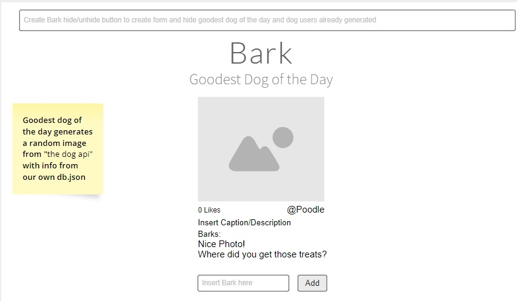
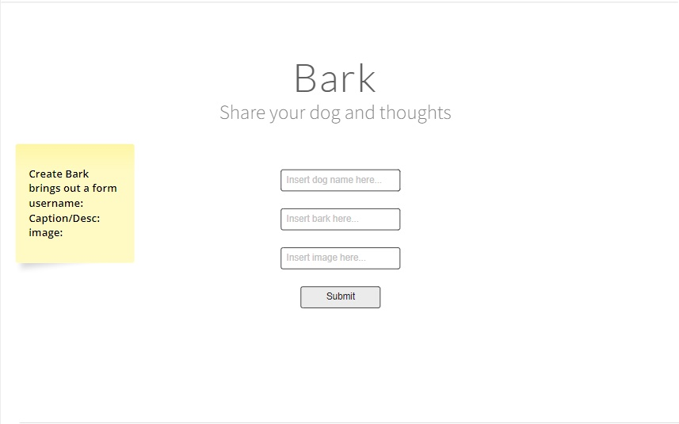
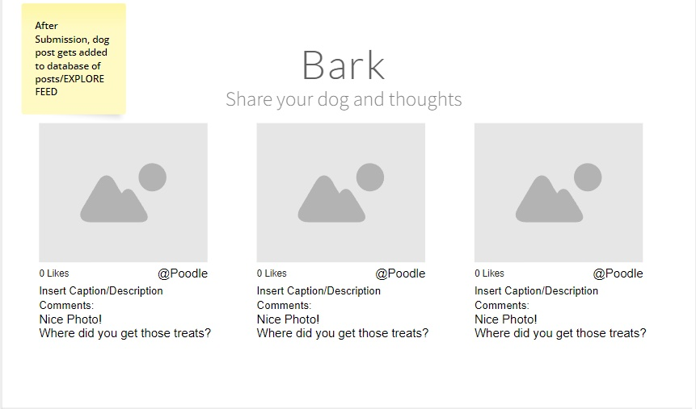

P1-Flatiron: Project 1, Flatiron School Software Engineering Live

### Creators: Jose Escobedo & Erin Van Brunt

# 
🐕 Dog Social Media 🐕

### Goals:

- Create an app that has stored data in a API JSON file (aka THE DOG API).
- Utilize open source random dog generator (aka DOG API).
- Reveal data from the API on page.
- Create 3 main features on page (either on one page with no routes or via dynamic JS).
  - Feature 1: <u>The Goodest Dog of the Day</u> shows random image of dog as breaking news.
  - Feature 2: <u>Dog User Profile</u> where the dog can add their profile picture and personal info.
  - Feature 3: <u>Dog's Friend's List</u> shows dogs from local database (photos, comments, description & likes).

### Stretch Goals:

- Let user log in & save their profile and info from the Friend List section using POST & PATCH.
- Extra CSS styling.
- Nav bar and routes to features as separate pages.
- Create a loop that translates all comments into "dog language."

### Wire Frames:

### User Story:

Sees open in browser and profile is revealed immediately- user sees a greeting, about the site and how to input their info.
When scrolling down the user sees some news about The Goodest dog of the day, and some of their dog friends.

### Resources:

- The Dog API:

  - Used the data base from free API- https://thedogapi.com/
  - Stored locally in our db.json file

- Dog API:

  - Restful free API that generates random dogs-https://dog.ceo/dog-api/
  - Accessed objects inside non-local API
